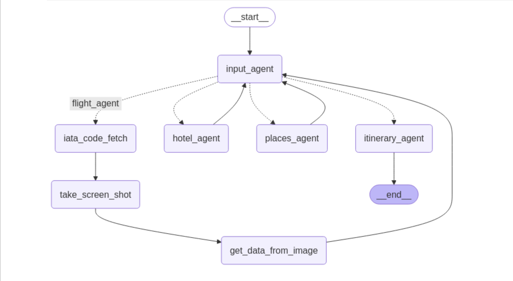

# Langchain Agent: itinerary_planner

This Langchain agent help you to plan itinerary including flight, hotel, places to visit. It uses components like `input_agent`, `flight_agent`, `hotel_agent`, `places_agent`, `itinerary_agent`, potentially `iata_code_fetch`, `take_screen_shot`, and `get_data_from_image`.

**Key Features:**

* Handles user input.
* Retrieves flight, hotel, and place information.
* Generates itineraries.

**Tech:** Langchain, Python, langgraph.

**Setup:** Clone repo, install requirements (`pip install -r requirements.txt`), configure environment variables.

**Usage:** run this in your jupyter notebook.

**Contribute:** create a feature request in the issues tab. after approval, create a PR

**License:** MIT.
